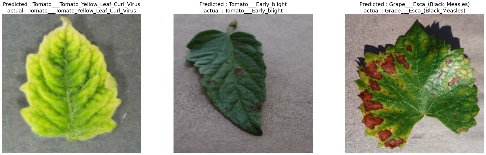
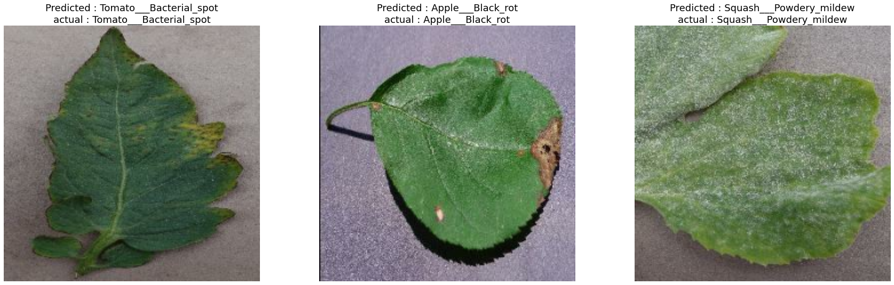
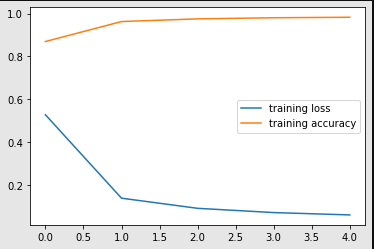

# Plant Disease Classification

This repository contains code for classifying plant diseases using deep learning.

## Introduction

Plant diseases can cause significant losses in crop yields and quality, which can impact food security and economic development. This project aims to develop a deep learning model that can accurately classify plant diseases from images, which can help farmers and researchers detect and manage plant diseases more effectively.

## Dataset

We used the [PlantVillage dataset](https://github.com/spMohanty/PlantVillage-Dataset) for training and evaluation. The dataset consists of over 54,000 images of healthy and diseased plant leaves, belonging to 38 different species. The dataset was split into training, validation, and testing sets with a 60:20:20 ratio.

## Model

We used a pre-trained ResNet50 model as the backbone network and added a fully connected layer to the end to produce the final classification. We fine-tuned the pre-trained ResNet50 model on the PlantVillage dataset using PyTorch.

## Requirements

* Python 3.x
* Tensorflwo
* Keras
* NumPy
* Matplotlib
* OpenCV
## Results

Below are some examples of the plant disease classification results:

As shown in the results, our model is able to accurately classify different plant diseases with high accuracy.